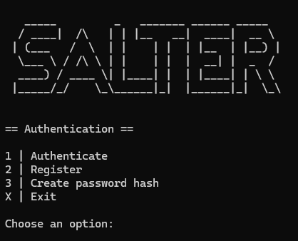

# Salter

**Salter** is a console-based application designed to explore and practice core security concepts in .NET. It is a role-based user management system that securely manages user credentials using encrypted JSON storage. Users can log in or register to perform various operations such as changing their username or password.



## Features

- **Secure Authentication** – Users must log in to access management features.  
- **Role-Based Access Control** – User permissions are determined by their role.  
- **Encrypted User Repository** – All credentials are securely stored using AES encryption.  
- **Password Security** – Passwords are hashed and salted before being persisted.  
- **Memory Safety** – Unhashed passwords are stored in **value types** and wiped from memory immediately after use.  
- **Environment-Based Secret Storage** – Encryption keys are never stored in plaintext.  
- **Interactive Console Interface** – A command-line menu system for managing users and passwords.  

## Planned Features

- Encryptor using the [.NET Data Protection API (DPAPI)](https://learn.microsoft.com/en-us/dotnet/standard/security/how-to-use-data-protection) 
- Multi-language support  

## How to Build  

### Using Visual Studio

1. Install **.NET 8** (Windows) and **Visual Studio**.  
2. Clone the repository:  
   ```sh
   git clone https://github.com/thomaswening/salter.git
   ```
3. Open the solution in Visual Studio and build the project.  

### Using .NET CLI

1. Install **.NET 8 SDK**.  
2. Clone the repository:  
   ```sh
   git clone https://github.com/thomaswening/salter.git
   ```
3. Navigate into the project directory and build:  
   ```sh
   dotnet build
   ```

## How It Works  

- On first launch, Salter creates a directory in `%APPDATA%/Salter/`, containing an **encrypted** user repository.  
- A **default user** (`username: default, password: default`) is created for initial access. It is recommended to change this password immediately.  
- Users can:  
  - **Authenticate or register**  
  - **Use the password hashing utility** (no authentication required)  
  - **Access user management features** (after authentication)  

### Role-Based Access Control  

- **Users** can modify their own credentials (username and password) or delete their account.  
- **Admins** can manage users, including creating and deleting accounts and promoting users to admin status.  
- **The Default User** cannot be deleted or renamed, but they have the exclusive ability to reset the repository or uninstall the application.  

## Uninstall Process  

The uninstallation process consists of two steps:  

1. **Deleting the application directory**  
   - The application directory, `%APPDATA%/Salter/`, is deleted first.  
   - If any errors occur during this step, the user is prompted to delete the directory manually.  
   - If they confirm, a file explorer window opens at the directory location, and the process continues only after the user verifies deletion.  

2. **Self-deletion of the executable**  
   - The application cannot delete its own executable directly. Instead, a **cmd process** is started that schedules the deletion via a timeout.

## Logging  

- Errors are displayed in the console with clear messages.  
- Fatal errors are logged in `%APPDATA%/Salter/` with unique filenames per execution (`error_log_X.txt`).  

## Solution Structure  

### Salter.Core  

Handles the domain logic and core functionality, including:  
- Contracts for data management  
- Encryption services  
- Password hashing  
- User authentication & role-based access  

### Salter.Persistence  

Manages data storage and encryption, including:  
- Data Transfer Objects (DTOs)  
- Encrypted user repository  
- DTO-to-object mapping  

### Salter.Cmd  

Provides an interactive console interface, including:  
- User input handling  
- Console-based menu system  
- Role-based access enforcement  

## License  

This project is licensed under the **GNU General Public License v3.0**. See the [LICENSE](LICENSE) file for details.  
